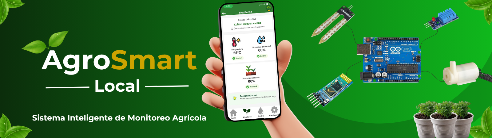

  

<h1 align="center">Proyecto AgroSmart Local</h1>

<h2 align="center">
Proyecto Integrador AgroSmart - Feria de Microcontroladores ICKW 2026
</h2>

## Descripción:
AgroSmart Local es un sistema inteligente de monitoreo agrícola desarrollado como proyecto integrador para la Feria de Microcontroladores ICKW 2026.

El proyecto busca facilitar el monitoreo de las condiciones ambientales de un cultivo mediante el uso de sensores conectados a un Arduino Uno y una aplicación móvil desarrollada en MIT App Inventor. Además de visualizar la información en tiempo real, la aplicación permite generar alertas cuando se detectan condiciones críticas y ofrece la posibilidad de activar manualmente una bomba de agua para realizar el riego del cultivo cuando sea necesario.

---

## Objetivo:

Desarrollar un sistema capaz de monitorear:

- Humedad del suelo
- Temperatura ambiental
- Humedad ambiental

permitiendo visualizar la información desde una aplicación móvil y generar alertas cuando se detecten condiciones críticas. De esta forma, el usuario conocerá el estado del cultivo desde una aplicación móvil, podrá tomar decisiones oportunas para mejorar el cuidado de las plantas y controlar manualmente el sistema de riego mediante una bomba de agua cuando las condiciones del suelo lo requiera.

#  Desarrollo del proyecto

AgroSmart Local se desarrolló por etapas, permitiendo construir el sistema de manera organizada.

## Etapa 1 – Diseño y Planificación del Sistema
Durante esta etapa se realizó:

- Definición detallada del problema.
- Objetivos general y específicos.
- Identificación de usuarios.
- Elaboración de casos de uso.
- Elaboración de diagrama de flujo.
- Diseño preliminar de la interfaz en MIT App Inventor.
- Diseño del modelo de base de datos.
- Investigación de sensores y componentes.

## Etapa 2 – Simulación y Programación del Prototipo en Tinkercad
En esta etapa se desarrolló la simulación del sistema utilizando Tinkercad.

Se realizó:

- Diseño del circuito electrónico en Tinkercad.
- Programación del comportamiento del sistema utilizando C++ dentro del entorno de simulación.
- Simulación del funcionamiento de los sensores disponibles en la plataforma.
- Realización de pruebas para verificar el comportamiento del prototipo.
- Grabación de un video explicativo mostrando el funcionamiento del circuito y la lógica de programación implementada durante la simulación.

## Etapa 3 – Desarrollo de la aplicación móvil

Actualmente el proyecto se encuentra en esta etapa.

Durante esta fase se desarrolló la aplicación móvil utilizando MIT App Inventor.

Se implementaron:

- Diseño de la interfaz gráfica de la aplicación.
- Desarrollo de las diferentes pantallas que conforman el sistema.
- Implementación de la lógica mediante programación por bloques.
- Configuración del almacenamiento local utilizando TinyDB.
- Preparación de la comunicación Bluetooth para la integración con Arduino.
- Realización de pruebas de funcionamiento y corrección de errores durante el desarrollo.
- Compilación del archivo .apk para realizar pruebas de instalación y funcionamiento en dispositivos móviles.

#  Estado actual

| Etapa | Estado |
|-------|:------:|
| Etapa 1 | Finalizada |
| Etapa 2 |  Finalizada |
| Etapa 3 |  Finalizada|
| Etapa 4 |  En Desarrollo|

#  Funciones de la Aplicación

| Funcionalidad | Estado |
|---------------|:------:|
| Inicio de sesión | Implementado |
| Registro de usuarios | Implementado |
| Menú principal | Implementado |
| Monitoreo de humedad del suelo | Implementado |
| Monitoreo de temperatura | Implementado |
| Monitoreo de humedad ambiental | Implementado |
| Sistema de alertas | Implementado |
| Recomendaciones para el usuario | Implementado |
| Configuración de la aplicación | Implementado |
| Control manual de la bomba de agua | Implementado |
| Comunicación Bluetooth | Preparada para la integración con Arduino |

# Tecnologías utilizadas

| Tecnología | Función |
|------------|---------|
| MIT App Inventor | Desarrollo de la aplicación móvil |
| Arduino Uno | Control del sistema |
| Bluetooth HC-05 | Comunicación inalámbrica |
| TinyDB | Almacenamiento local |
| Tinkercad Circuits | Simulación electrónica |
| GitHub | Control de versiones |

## Lenguajes de programación utilizados:

- C++
-  Programación por bloques (MIT App Inventor)

## Integrante:
- Gissel Adayari Díaz López

  

